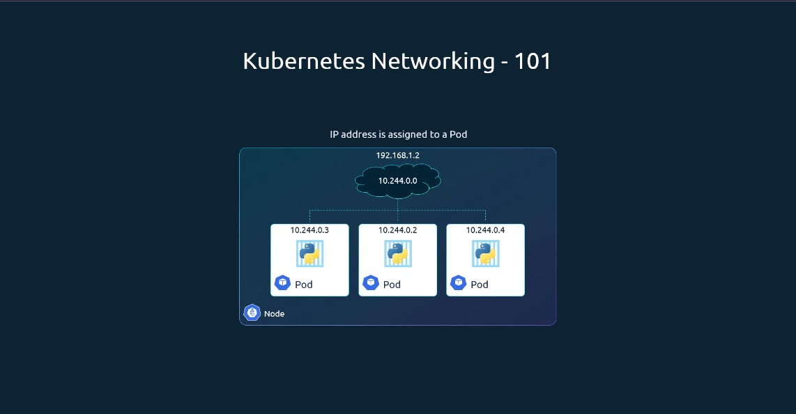
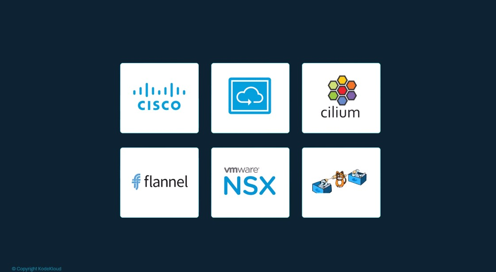
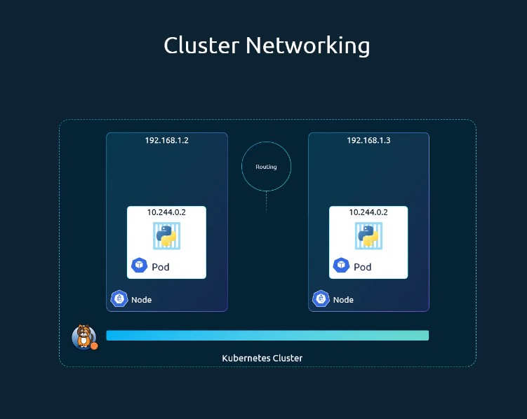

#### Networking

- In kubernetes, POD are assigned IP address and not the containers.  
- When kubernetes is setup, it's creates a virtual network with address: 10.244.0.0
- When pods are created, they might get a IP address in the range like 10.244.0.2, 10.244.0.3, 10.244.0.4. 
- Within the same node, PODs will be able to communicate with each other using the kubernetes network. However, Kubernetes expects cluster to implement it's own solution to enable communication between different pods. 

Example of Netwoking solution thats responsible for assiging IP addresses to PODs. 

