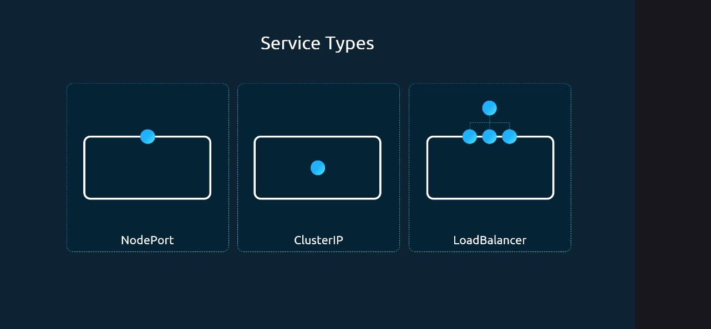
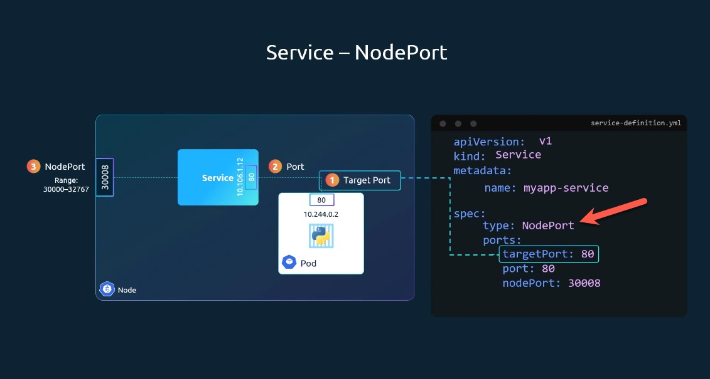
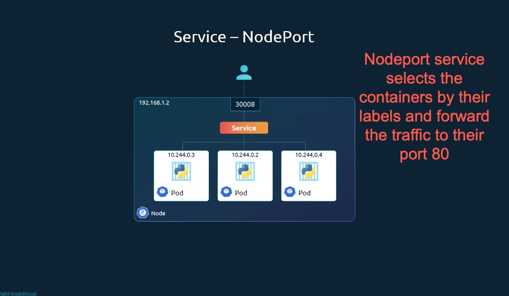
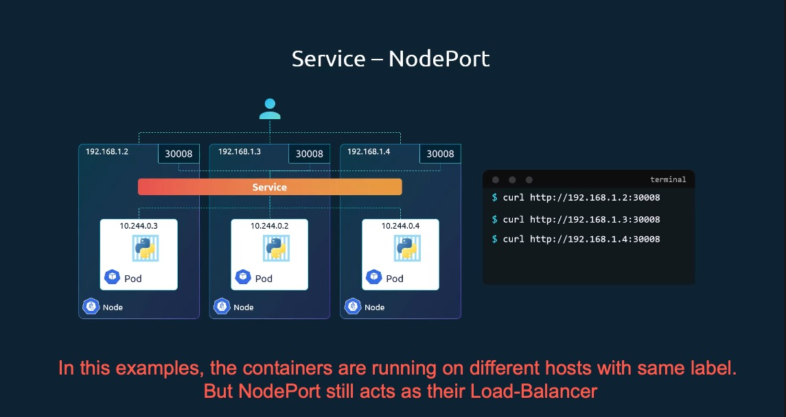
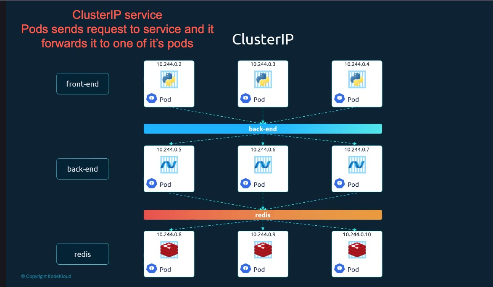
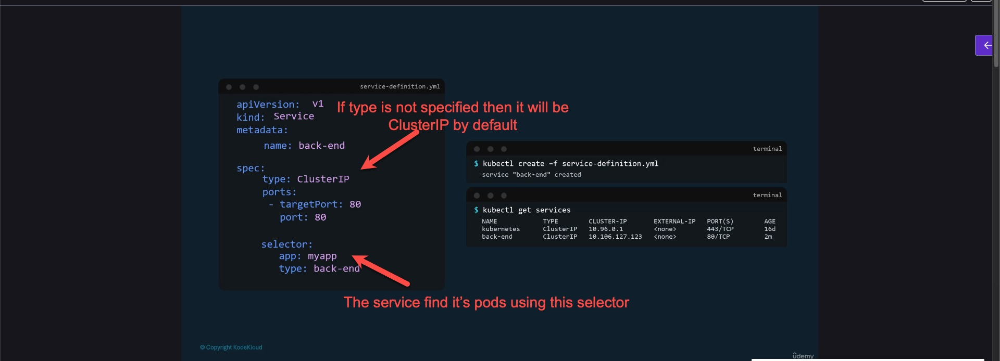

## Services













```
$ kubectl create -f deployment.yaml
deployment.apps/myapp-deployment created

$ kubectl get all
NAME                                    READY   STATUS    RESTARTS   AGE
pod/myapp-deployment-597667964f-86ftp   1/1     Running   0          11s
pod/myapp-deployment-597667964f-c2tdt   1/1     Running   0          11s
pod/myapp-deployment-597667964f-g568b   1/1     Running   0          11s
pod/myapp-deployment-597667964f-psf6c   1/1     Running   0          11s
pod/myapp-deployment-597667964f-vwnvj   1/1     Running   0          11s
pod/myapp-deployment-597667964f-xzx22   1/1     Running   0          11s


NAME                 TYPE        CLUSTER-IP   EXTERNAL-IP   PORT(S)   AGE
service/kubernetes   ClusterIP   10.96.0.1    <none>        443/TCP   2d1h

NAME                               READY   UP-TO-DATE   AVAILABLE   AGE
deployment.apps/myapp-deployment   6/6     6            6           11s

NAME                                          DESIRED   CURRENT   READY   AGE
replicaset.apps/myapp-deployment-597667964f   6         6         6       11s

$ kubectl create -f service-nodeport.yaml 
service/myapp-service created

$ kubectl get svc
NAME            TYPE        CLUSTER-IP    EXTERNAL-IP   PORT(S)        AGE
kubernetes      ClusterIP   10.96.0.1     <none>        443/TCP        2d1h
myapp-service   NodePort    10.107.9.90   <none>        80:30004/TCP   36s


# Note: I was not able to access nginx service with 127.0.0.1:30004, so we can use the following alternative
$ minikube service myapp-service --url
http://127.0.0.1:56802
❗  Because you are using a Docker driver on darwin, the terminal needs to be open to run it.
```

#### Service - Cluster-IP

#### Service - LoadBalancer


